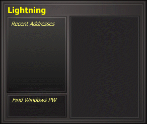



## A program that controls a remote computer

### Description

The code is still here, however I am working on an updated version. It will include a new chat, and several other things. If anyone is interested in joining me in creating this program email me at steve81@mediaone.net. Basicly what I am looking to do is get people who may know some cool control functions to add to it, and how to do them. I welcome all to join. It is only on request though, there is no money involved, however you will get your name in the credits, and if you have a website that too.
 
### More Info
 

             |
---                |---
**Submitted On**   |1999-07-13 12:41:48
**By**             |[Steve](https://github.com/Planet-Source-Code/PSCIndex/blob/master/ByAuthor/steve.md)
**Level**          |Unknown
**User Rating**    |4.3 (34 globes from 8 users)
**Compatibility**  |VB 5\.0, VB 6\.0
**Category**       |[Complete Applications](https://github.com/Planet-Source-Code/PSCIndex/blob/master/ByCategory/complete-applications__1-27.md)
**World**          |[Visual Basic](https://github.com/Planet-Source-Code/PSCIndex/blob/master/ByWorld/visual-basic.md)
**Archive File**   |[CODE\_UPLOAD110\.zip](https://github.com/Planet-Source-Code/steve-a-program-that-controls-a-remote-computer__1-2468/archive/master.zip)

